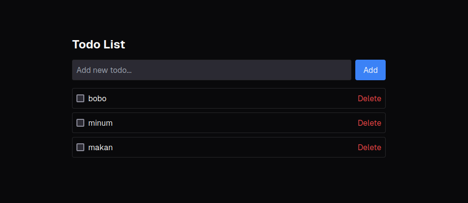

# T3 Stack Todo App

A full-stack Todo application built with the T3 Stack (Next.js, TypeScript, Prisma, tRPC, and Tailwind CSS).

## Tech Stack

- [Next.js](https://nextjs.org) - React framework for production
- [TypeScript](https://www.typescriptlang.org/) - Static typing for JavaScript
- [Prisma](https://prisma.io) - Database ORM
- [tRPC](https://trpc.io) - End-to-end typesafe APIs
- [Tailwind CSS](https://tailwindcss.com) - Utility-first CSS framework

## Getting Started

1. Clone the repository:
```bash
git clone <your-repo-url>
cd t3-todo-app
```

2. Install dependencies:
```bash
npm install
# or
yarn install
```

3. Set up your environment variables:
```bash
cp .env.example .env
```

4. Set up the database:
```bash
npx prisma db push
```

5. Run the development server:
```bash
npm run dev
# or
yarn dev
```

### Database Schema

```prisma
model Todo {
    id        String   @id @default(cuid())
    title     String
    completed Boolean  @default(false)
    createdAt DateTime @default(now())
    updatedAt DateTime @updatedAt
}
```
## License
MIT License - see the [LICENSE](LICENSE) 

## Acknowledgments

- [Create T3 App](https://create.t3.gg/)
- [Prisma Documentation](https://www.prisma.io/docs/)
- [tRPC Documentation](https://trpc.io/docs)
- [Tailwind CSS Documentation](https://tailwindcss.com/docs)